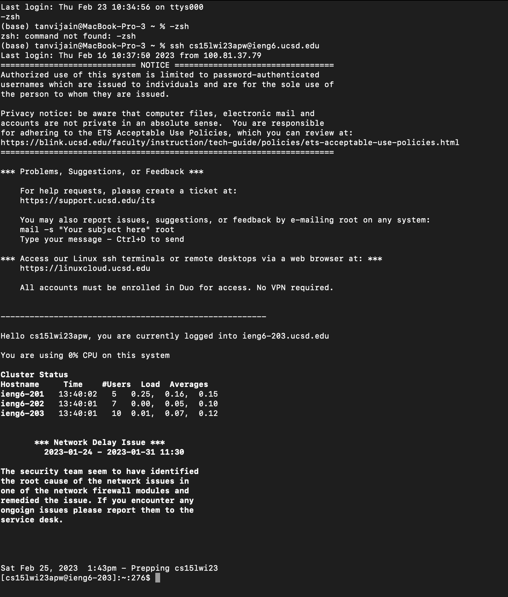
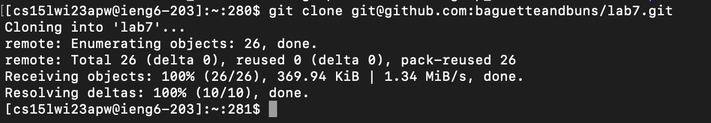
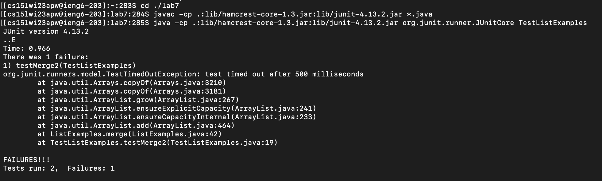
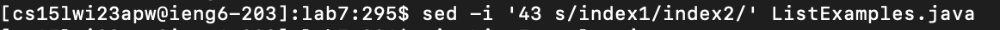
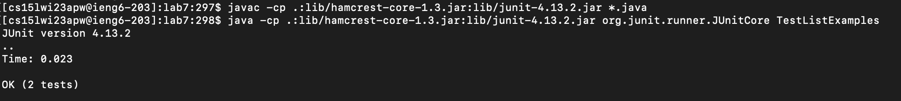

# Week 8 Lab Report 4
## Step 4

Keys pressed: ssh cs15lwi23apw@ieng6.ucsd.edu <enter>
## Step 5

Keys pressed: git clone <ctrl-v> <enter>
## Step 6

  
Keys pressed: cd ./lab7 <enter> <ctrl-v> <enter> <ctrl-v> <enter>
## Step 7

  
Keys pressed: sed -i '43 s/index1/index2/' ListExamples.java <enter>
## Step 8

  
Keys pressed: <up> <up> <up> <up> <up> <up> <enter> <up> <up> <up> <up> <up> <enter>

